# Mini-SIEM Python — Pipeline de sécurité SSH sur Ubuntu

Un SIEM ("Security Information and Event Management") simplifié, construit de A à Z en Python, sans utiliser d'outil tout fait comme Graylog ou Wazuh. Le but : comprendre et démontrer, brique par brique, comment un log brut devient une alerte de sécurité exploitable — exactement le travail que fait un analyste SOC avec des outils comme Splunk ou QRadar, mais ici entièrement fait main pour prouver une vraie compréhension du fonctionnement interne.

Toutes les données utilisées dans ce projet, sauf mention contraire ("mode démo"), proviennent de vrais logs système générés par une VM Ubuntu personnelle — pas de données inventées.

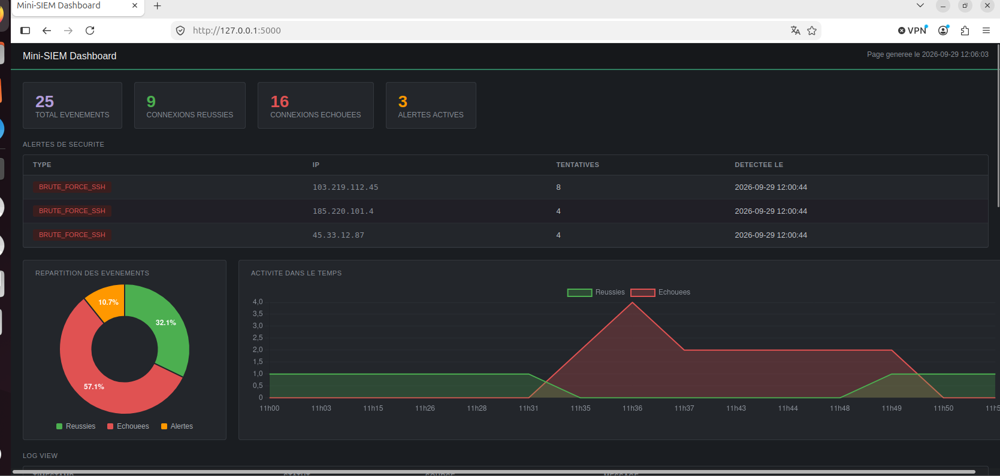

## Sommaire

- Pourquoi ce projet
- Architecture du pipeline
- Structure des fichiers
- Installation
- Brique par brique : explications et résultats
- Commandes utilisées, en résumé
- Limites actuelles et pistes d'amélioration

## Pourquoi ce projet

Un SIEM professionnel collecte les logs de toute une infrastructure, les centralise, les analyse, et alerte quand il détecte un comportement suspect. Savoir utiliser un SIEM est une chose ; savoir comment il fonctionne à l'intérieur en est une autre — et c'est cette seconde compétence que ce projet démontre.

Chaque brique a été construite, testée et validée avec de vrais scénarios (y compris une simulation manuelle d'attaque brute-force via plusieurs tentatives SSH échouées rapprochées), avant de passer à la suivante.

## Architecture du pipeline

Logs systeme SSH --> Collecteur --> Base de donnees --> Moteur de detection --> Dashboard / alertes
(journalctl) (lire_logs.py) (logs.db) (detection.py) (dashboard.py)

Le tout est automatisé via une tâche cron qui exécute la collecte et la détection toutes les 2 minutes, sans intervention manuelle.

## Structure des fichiers

mini-siem/
venv/ environnement virtuel Python
lire_logs.py collecteur : lit journalctl, parse, stocke
detection.py moteur de detection : regle brute-force SSH
pipeline.sh script qui enchaine collecteur + detection
pipeline.log journal des executions automatiques (cron)
demo.py generateur de donnees simulees (portfolio)
restore.py restauration des vraies donnees apres une demo
logs.db base de donnees SQLite (tables: evenements, alertes)
dashboard.py serveur web Flask
templates/index.html interface du dashboard (HTML + Jinja2 + Chart.js)

## Installation

git clone (url-du-repo)
cd mini-siem
python3 -m venv venv
source venv/bin/activate
pip install flask
python3 dashboard.py

Puis ouvrir http://127.0.0.1:5000 dans un navigateur.

Prérequis système : un service SSH actif (sudo apt install openssh-server) pour que journalctl ait des logs à lire.

## Brique par brique : explications et résultats

### 1. Collecte des logs (lire_logs.py)

Objectif : lire les vrais logs SSH du système et en extraire les informations utiles (statut de connexion, utilisateur, IP).

Commande système utilisée pour explorer les logs avant de coder :
journalctl -u ssh --since "30 minutes ago" -o json --no-pager

Cette commande affiche les logs du service SSH au format JSON structuré, ce qui permet de récupérer facilement des champs précis comme MESSAGE (le texte du log) et __REALTIME_TIMESTAMP (la date en microsecondes depuis epoch).

Logique du script :
resultat = subprocess.run(["journalctl", "-u", "ssh", "--since", "30 minutes ago", "-o", "json", "--no-pager"], capture_output=True, text=True)

subprocess.run exécute la commande système journalctl directement depuis Python et récupère sa sortie texte.

match = re.search(r"(Accepted|Failed) password for (\w+) from ([\d.]+)", message)

Une expression régulière extrait trois informations d'une ligne de log brute : le statut (Accepted/Failed), l'utilisateur ciblé, et l'adresse IP d'origine.

Résultat attendu et obtenu : chaque connexion SSH (réussie ou échouée) sur la machine devient un dictionnaire structuré, puis une ligne dans la base de données :
{'date': ..., 'statut': 'Accepted', 'utilisateur': 'orlya', 'ip': '127.0.0.1'}

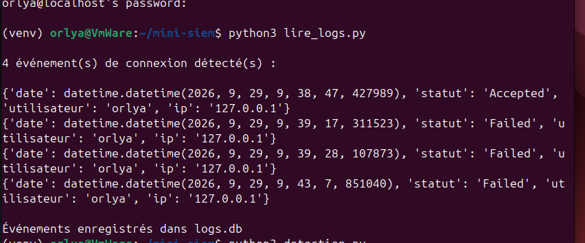

Anti-doublons : le script peut être relancé autant de fois que voulu sans dupliquer les mêmes événements, grâce à une contrainte SQL UNIQUE combinée à INSERT OR IGNORE :
curseur.execute("INSERT OR IGNORE INTO evenements (date, statut, utilisateur, ip) VALUES (?, ?, ?, ?)", (str(date_lisible), statut, utilisateur, ip))

### 2. Stockage en base de données (logs.db)

Objectif : conserver les événements de façon permanente (contrairement à un simple affichage en mémoire qui disparaît à chaque exécution).

Schéma de la table evenements :
CREATE TABLE evenements (id INTEGER PRIMARY KEY AUTOINCREMENT, date TEXT, statut TEXT, utilisateur TEXT, ip TEXT, UNIQUE(date, statut, utilisateur, ip))

La contrainte UNIQUE sur la combinaison des quatre colonnes garantit qu'un même événement ne peut jamais être enregistré deux fois, même si le collecteur est relancé plusieurs fois sur la même fenêtre de temps.

Une seconde table, alertes, suit le même principe pour stocker les détections du moteur d'analyse :

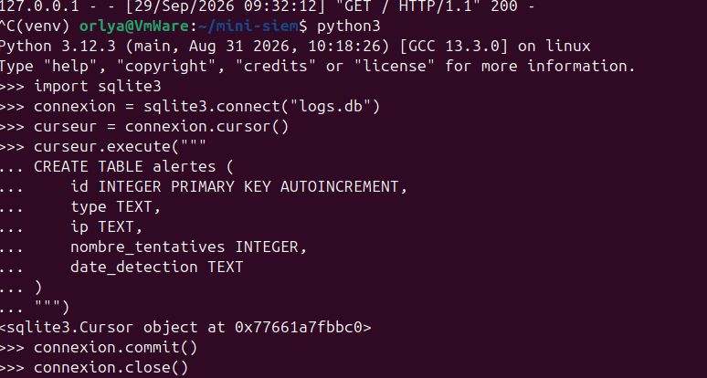

### 3. Moteur de détection (detection.py)

Objectif : analyser les événements stockés pour repérer un pattern d'attaque — ici, une tentative de brute-force SSH.

Règle appliquée : si une même adresse IP accumule 3 échecs de connexion ou plus en moins de 2 minutes, une alerte est déclenchée.

Logique clé — la fenêtre glissante :
for i in range(len(dates)):
fenetre = [d for d in dates if dates[i] <= d <= dates[i] + timedelta(minutes=FENETRE_MINUTES)]
if len(fenetre) >= SEUIL_TENTATIVES:
alerte declenchee

Pour chaque échec d'une IP, le script regarde combien d'autres échecs de la même IP sont survenus dans les 2 minutes suivantes. C'est cette logique de "fenêtre glissante" qui permet de détecter un rythme d'attaque anormal, plutôt que de simplement compter un total sur toute l'historique.

Résultat attendu et obtenu : en simulant manuellement 4 tentatives de connexion SSH échouées en moins de 2 minutes, le script a correctement généré l'alerte suivante, stockée en base :
ALERTE : 4 echecs depuis 127.0.0.1 en moins de 2 minutes
(1, 'brute_force_ssh', '127.0.0.1', 4, '2026-09-29 09:45:30')

Anti-doublons des alertes : même principe que pour les événements, via une contrainte UNIQUE(type, ip, nombre_tentatives) et INSERT OR IGNORE, pour que relancer la détection plusieurs fois ne crée pas de fausses alertes répétées.

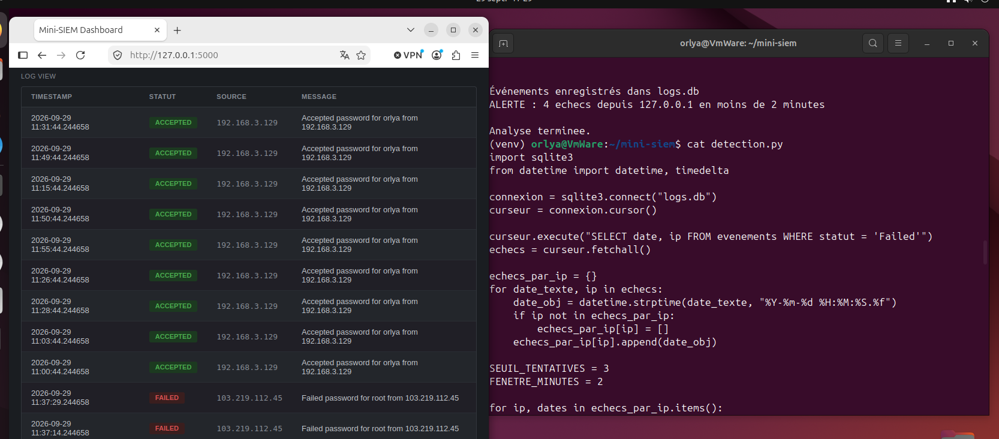

Vérification directe en base de données que l'alerte a bien été enregistrée durablement :

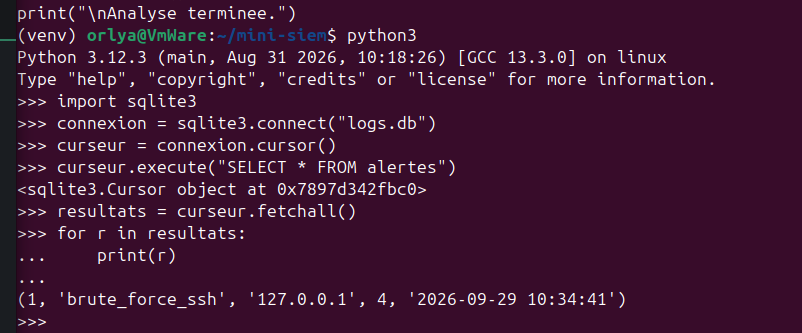

### 4. Dashboard web (dashboard.py + templates/index.html)

Objectif : donner une vue d'ensemble visuelle et consultable dans un navigateur, comme le ferait un vrai SIEM (inspiré de l'interface Graylog).

Stack utilisée : Flask (micro-framework Python) pour le serveur web, Jinja2 (inclus avec Flask) pour injecter les données Python dans le HTML, et Chart.js (bibliothèque JavaScript) pour les graphiques.

Le pont Python vers HTML :
return render_template("index.html", evenements=evenements, alertes=alertes, total=total, reussies=reussies, echouees=echouees)

Cette ligne envoie toutes les données calculées côté Python vers le template, qui les affiche avec la syntaxe Jinja2.

Éléments affichés :
4 cartes de statistiques : total d'événements, connexions réussies, échouées, alertes actives
Un tableau dédié aux alertes de sécurité détectées
Un camembert avec répartition en pourcentage
Un graphique en aires montrant l'activité dans le temps
Un tableau détaillé de tous les logs, avec badges de statut colorés

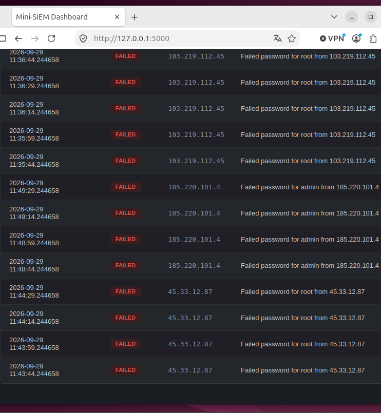

### 5. Automatisation avec cron

Objectif : faire tourner le pipeline en continu, sans action manuelle — comme un vrai SIEM en production.

Script d'enchaînement (pipeline.sh) :
cd /home/orlya/mini-siem
source venv/bin/activate
python3 lire_logs.py >> pipeline.log 2>&1
python3 detection.py >> pipeline.log 2>&1

Tâche planifiée (crontab) :
*/2 * * * * /home/orlya/mini-siem/pipeline.sh

Cette ligne exécute pipeline.sh automatiquement toutes les 2 minutes.

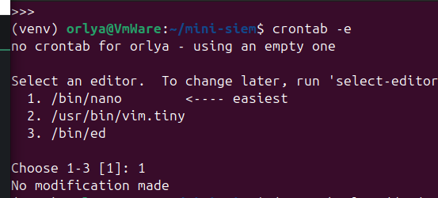

Résultat attendu et obtenu : vérification via les logs système de cron, qui confirme l'exécution automatique du script aux horaires prévus.

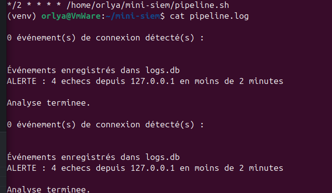

Un test de bout en bout a confirmé le fonctionnement complet : une connexion SSH a été effectuée sans lancer aucun script manuellement, et l'événement est apparu automatiquement dans le dashboard après le délai de 2 minutes, uniquement grâce à cron.

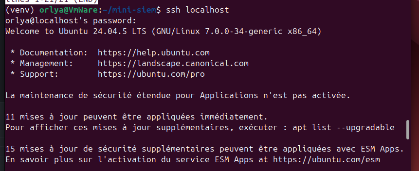

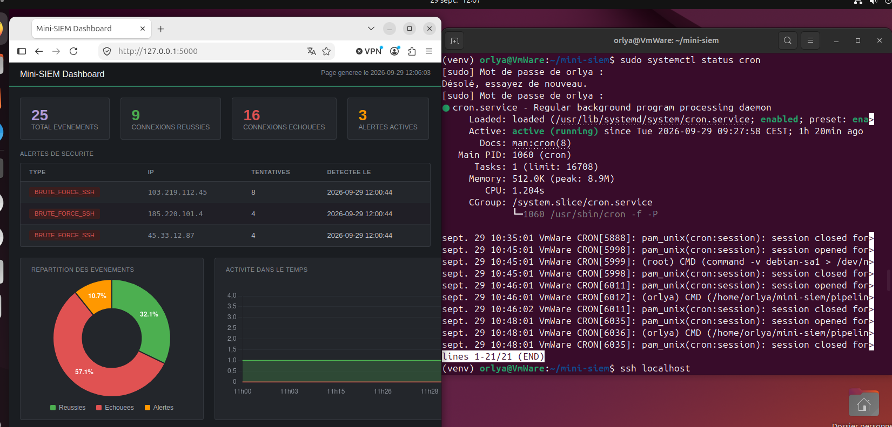

### 6. Mode démo (demo.py + restore.py)

Objectif : générer des données simulées pour obtenir des captures d'écran de portfolio plus riches, sans jamais perdre ni falsifier les vraies données.

Fonctionnement honnête : demo.py sauvegarde d'abord la vraie base avant de la vider et d'y insérer des données clairement fictives. restore.py permet de revenir aux vraies données à tout moment.

Résultat obtenu : 26 événements simulés générés, répartis sur 3 adresses IP attaquantes distinctes, avec 3 alertes de brute-force déclenchées automatiquement.

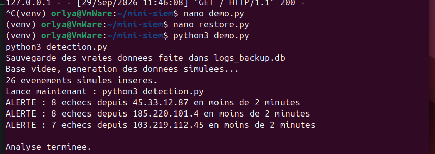

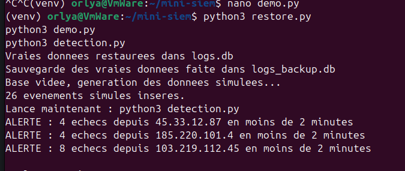

## Commandes utilisées, en résumé

journalctl -u ssh -o json --since : Extraire les logs SSH bruts au format structuré
python3 -m venv venv / source venv/bin/activate : Isoler les dépendances du projet
pip install flask : Installer le framework web
sqlite3 (via le module Python) : Créer, interroger et modifier la base de données
chmod +x pipeline.sh : Rendre le script d'automatisation exécutable
crontab -e / crontab -l : Configurer et vérifier la tâche planifiée
systemctl status cron : Vérifier que le service cron tourne

## Limites actuelles et pistes d'amélioration

Une seule règle de détection est implémentée (brute-force SSH). D'autres règles pourraient être ajoutées : usage sudo anormal, création de compte suivie d'un accès sudo immédiat, pic soudain de volume de logs.
Pas de géolocalisation des IP attaquantes.
Le dashboard n'est pas encore protégé par une authentification.
Les logs sont actuellement limités à SSH.
